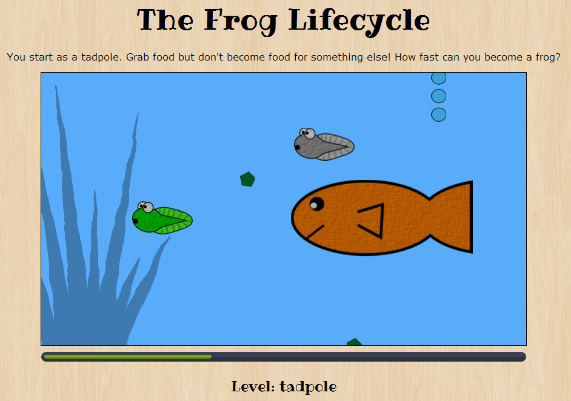

## The Game

Frogs. They know change all their lives. Starting out as tadpoles, they have to eat but not be eaten. They grow legs, lose their tails, and have to live on land for a while. But they return to the pond to start the cycle of life over again.

I wrote this simple HTML5 Canvas game for the [GitHub Game-off 2013](https://github.com/github/game-off-2013). The theme was "change", which worked out well because I was able to make a frog-related game. Most of the things I create tend to be frog-related.

### How to Play

In this game, you guide your tadpole through its metamorphosis. Use the arrow keys (or the WASD keys) to grab falling food while avoiding other tadpoles and hungry fish. Frog it up in the shortest time possible! Then just when you think you've mastered it, the game completely changes. In the second round, you have 1 minute to send fully-grown frogs back into the pond. Just aim with the arrow keys (or A and D keys), then jump by pressing the up arrow (or W). You get points for landing on lilypads, and can get more time for eating bugs that might fly past.

### Browser Compatibility

The game works in modern web browsers

  * Chrome 24+
  
  * Firefox 23+
  
  * Internet Explorer 10+
  
Unfortunately, it can't be played on mobile devices. You'll need a real computer for this one. This is mostly because you move with the keyboard.

## Software

This project would not be possible without the following open source software packages. You can find the complete license information [here](license.txt).

  * [jQuery](http://jquery.com/) - https://github.com/jquery/jquery

  * [SoundManager2](schillmania.com) - https://github.com/scottschiller/SoundManager2

  * The animated progress bar for jQuery by Ivan Lazarevic. - https://github.com/kopipejst/progressbar

## Game Assets

### Graphics

I created the images used in the game - all the frogs, fish, plants, etc. I used [Inkscape](http://inkscape.org/) and [GIMP](http://www.gimp.org/).
I am making them available here under the [Creative Commons Attribution-NonCommercial license] (http://creativecommons.org/licenses/by-nc/3.0/).

### Music

The game music is licensed under Creative Commons: By Attribution 3.0.

  * "River Valley Breakdown" Kevin MacLeod ([incompetech.com](http://incompetech.com/music/royalty-free/index.html?isrc=USUAN1300032)) 

### Sound Effects

The game sound effects are also licensed under Creative Commons: By Attribution 3.0.

  * "Error" by Autistic Lucario - http://www.freesound.org/people/Autistic%20Lucario/sounds/142608/

  * "Beeps-18" by Greencouch - http://www.freesound.org/people/Greencouch/sounds/124900/

  * "game over03" by notchfilter - http://www.freesound.org/people/notchfilter/sounds/43698/

  * "level up" by Benboncan - http://www.freesound.org/people/Benboncan/sounds/90633/
  
  * "water splash" by soundscalpel.com - http://www.freesound.org/people/soundscalpel.com/sounds/110393/
  
  * "ta-daa" by rdholder - http://www.freesound.org/people/rdholder/sounds/177120/
  
  * "20100424.bee.wav" by dobroide - http://www.freesound.org/people/dobroide/sounds/95817/

### Font

The font used in all the game displays is "Ribeye" by Brian J. Bonislawsky DBA Astigmatic (AOETI)
(astigma@astigmatic.com)

http://www.fontspace.com/astigmatic-one-eye-typographic-institute/ribeye

## Author

This game was created by Casey Leonard. You can find out everything you will ever want to know about me at http://caseyleonard.com.
