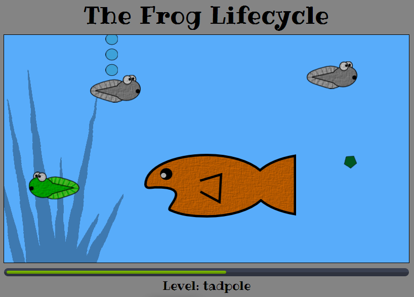

## The Game

Frogs. They know change all their lives. Starting out as tadpoles, they have to eat but not be eaten. They grow legs, lose their tails, and have to live on land for a while. But they return to the pond to start the cycle of life over again.

In this HTML5 Canvas game, you guide your tadpole through its metamorphosis. Use the arrow keys to grab falling food while avoiding other tadpoles and hungry fish. Frog it up in the shortest time possible! Then play the bonus round where you send fully-grown frogs back into the pond! Just aim with the left and right arrow keys, then jump by pressing the up arrow. You get points for landing on lilypads.

It works in modern web browsers, but not on mobile devices. You'll need a real computer for this one.

I wrote this simple game in JavaScript for the [GitHub Game-off 2013](https://github.com/github/game-off-2013).

## Game Graphics

The background is licensed under Creative Commons: Attribution-ShareAlike 3.0. "Retina Wood" by Atle Mo - http://subtlepatterns.com/retina-wood/

I made the other game images - all the frogs, fish, plants, etc. I used [Inkscape](http://inkscape.org/) and [GIMP](http://www.gimp.org/). Please don't use the frog images without my permission. I'd be happy to draw some for you if you ask.

## Open Source Software

This project uses the following open source software packages. You can find the complete license information [here](license.txt).

[jQuery](http://jquery.com/) - https://github.com/jquery/jquery

[SoundManager2](schillmania.com) - https://github.com/scottschiller/SoundManager2

The animated progress bar for jQuery by Ivan Lazarevic. - https://github.com/kopipejst/progressbar

## Music

The game music is royalty-free and licensed under Creative Commons: By Attribution 3.0.

"River Valley Breakdown" Kevin MacLeod ([incompetech.com](http://incompetech.com/music/royalty-free/index.html?isrc=USUAN1300032)) 

## Sound Effects

The game sound effects are also licensed under Creative Commons: By Attribution 3.0.

"Error" by Autistic Lucario - http://www.freesound.org/people/Autistic%20Lucario/sounds/142608/

"Beeps-18" by Greencouch - http://www.freesound.org/people/Greencouch/sounds/124900/

"game over02" by notchfilter - http://www.freesound.org/people/notchfilter/sounds/43697/

"level up" by Benboncan - http://www.freesound.org/people/Benboncan/sounds/90633/

